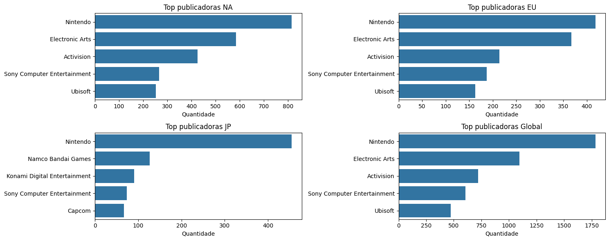
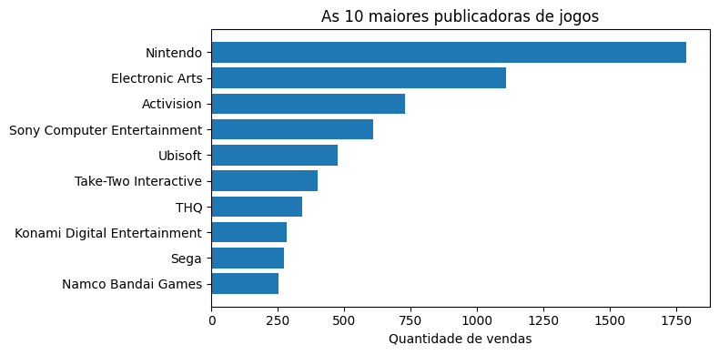
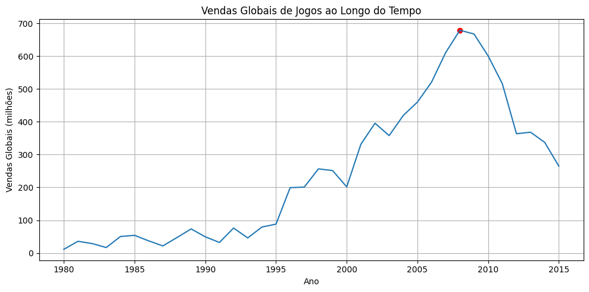

# Análise de vendas de jogos - Python

## 📝 Descrição do projeto
Projeto desenvolvido para realizar análises sobre as vendas de jogos ao redor do mundo.
O tema foi escolhido por unir duas áreas de meu interesse, jogos e análise de dados.
A partir desses dados, foi possível aplicar técnicas de análises, manipulação e geração de gráficos para gerar insights sobre o mercado global de jogos.
Esse projeto, foi desenvolvida usando a linguagem Python e feita no ambiente do Google Colab.
As variáveis de vendas (sales) estão expressas em milhões de unidades vendidas.

## 🎲 Dados
Os dados utilizados foram obtidos no Kaggle
- Dataset: Video Games Sales
- Link: https://www.kaggle.com/datasets/ulrikthygepedersen/video-games-sales

## 🛠️ Ferramentas
- Google Collab
- Kaggle API
- Python

biliotecas do Python utilizadas:
- os
- Kaggle
- Pandas
- Matplotlib
- Seaborn

## 🔄 Processo de obtenção, visualização e tratamento dos dados

A obtenção dos dados foram realizadas a partir do Python, utilizando a API do Kaggle, nesta parte, foram utilizadas ferramentas de apoio como o ChatGPT, para o auxílio ao processo de aprendizado e dúvidas.
Após a obtenção e o carregamento dos dados, foram aplicadas etapas de limpeza, tratamento e visualização dos dados.

Os primeiros passos foram carregar os dados e verificar se algum campo apresentava irregularidades, como valores nulos. Nesta verificação, foi identificado que as colunas de ano e publicadora, apresentavam alguns valores nulos e, devido à grande quantidade, não foi adequado realizar o preenchimento manual desses valores. Por isso, optei pela remoção desses dados nulos por não comprometer significamente a análise.

Após essa etapa, foram aplicadas técnicas de análise em Python para identificar diferentes insights, utilizando o método groupby com funções de agregações.  No dataset, observou-se que, após o ano de 2015, havia pouca quantidade de registros, e para não comprometer o gráfico temporal, decidi usar o filter para filtrar apenas jogos lançados até 2015.

## 📊 Gráficos gerados 

<table align = "center">
  <tr>
    <td align="center" style="padding:15px;">
      
    </td>
    <td align="center" style="padding:15px;">
      
    </td>
  </tr>
  <tr>
    <td align="center" style="padding:15px;">
      
    </td>
      <td align="center" style="padding:15px;">
      
    </td>
  </tr>
</table>

## ❓ Perguntas
Este projeto busca responder algumas das seguintes questões:

- Quais gêneros de jogos apresentaram maior volume de vendas em cada região?
- Quais publicadoras concentraram o maior volume de vendas globais e de cada região?
- Quais as plataformas que apresentam maior volume de vendas globalmente?
- Como as vendas globais de jogos evoluíram ao longo dos anos?
- Em quais períodos ocorreu o maior crescimento das vendas globais?
- Existem diferenças significativas de preferência por gêneros entre as regiões?

## 💡 Insights obtidos

- Gêneros como ação, esporte e de tiro apresentam a maior quantidade de vendas nas regiões da América do Norte (NA) e da Europa (EU), enquanto na região do Japão, os gêneros mais vendidos foram role-playing, ação e esporte, destacando o gênero de role-playing, que mostra uma grande diferença em relaçao aos demais. Esse resultado indica uma maior preferência do público japonês por jogos desse gênero.
- As maiores publicadoras em termos de vendas globais foram Nintendo, Eletronic Arts (EA) e Activision, e regiões da América do Norte (NA) e da Europa (EU) seguem o mesmo padrão, com essas publicadoras concentrando as maiores vendas. Já no Japão, a Nintendo continua sendo a publicadora líder em vendas, entretanto, as publicadoras com maiores vendas após a Nintendo, foram Namco Bandai e Konami. Essa tendência sugere que as publicadoras de origem japonesa apresentam melhor desempenho no mercado doméstico, possivelmente devido ao reconhecimento consolidade dessas marcas no Japão.
- As plataformas que mais venderam globalmente de acordo com o DataFrame foi (em ordem): PS2, X360, PS3, Wii e DS.
- Podemos visualizar no gráfico temporal que, antes de 1995, as vendas de jogos ao redor do mundo, mantinham aproximadamente entre 50 a 80 milhões de unidades vendidas, e entre 1995 e 2003, houve um grande aumento, atingindo um pico de 400 milhões de unidades. A partir de 2003, teve um aumento significativo nas vendas globais, atingindo um novo pico de aproximadamente 650 milhões de vendas entre 2006 e 2008, quase o dobro do pico anterior, esse fato pode estar relacionado à expansão das indústrias e o surgimento de novos consoles e novas funcionalidades, como PS2, XBOX360 e o Nintendo Wii o aumento de interesse do público para o mercado de jogos eletrônicos.
- Após o pico no ano de 2006 e 2008, houve uma queda nas vendas globais, indicando uma saturação no mercado dos jogos.
